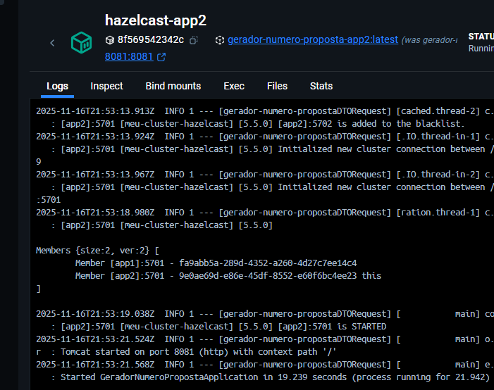

Requisito,
Ter o DockerFile instalado.

1 - passo, gerar o pacote do programa.
mvn clean package -DskipTests

2 - passo subir o docker file que vai publicar 2 instancias da aplicação nos conteiner do docker
docker-compose up --build

3 - Observar no Dockerm que há 2 membros, 2 aplicações direncionando parao  hazelcast

4- Tem TTL configurado na classe HazelcastConfiguration, altere caso deseje ter o registro por mais tempo.
mapaPropostaConfig
.setTimeToLiveSeconds(30);//expira em 30 segundos

