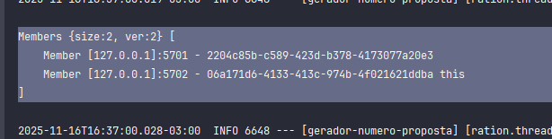

Subir as 2 aplicações pelo maven

mvn spring-boot:run -Dspring-boot.run.arguments="--server.port=8080"
mvn spring-boot:run -Dspring-boot.run.arguments="--server.port=8081"

após a execução do segundo pode.
Tem que aparecer 2 membros.

Teste 1, retorna o mesmo valor.

GET
http://localhost:8080/produtos/1

get
http://localhost:8081/produtos/1

Teste 2, inserir por uma aplicação na porta 8080

curl --request POST \
--url 'http://localhost:8080/produtos/direto/99?valor=teste-hazelcast'

Buscar pela pela segunda instancia oque foi inserida pela primerira.
curl --request GET \
--url 'http://localhost:8081/produtos/direto/99?valor=teste-hazelcast'

